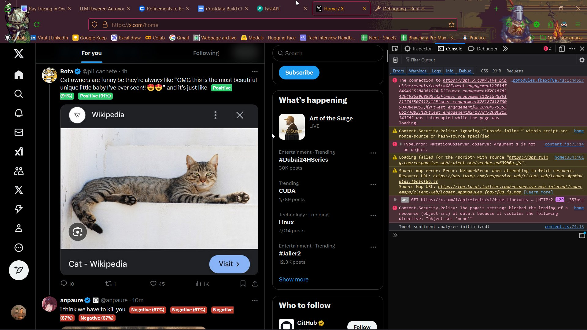

We kinda built a half assed firefox extension which can analyze tweet sentiment for all tweets displayed on the browser screen. Uses naive bayes to analyze the sentiment for each tweet. Frontend is bad and by all means criticize us for the same :)

## Demo:

## How to run
- Boot up the server.
- Upload the manifest.json file to firefox to use the extension locally.
- Run twitter